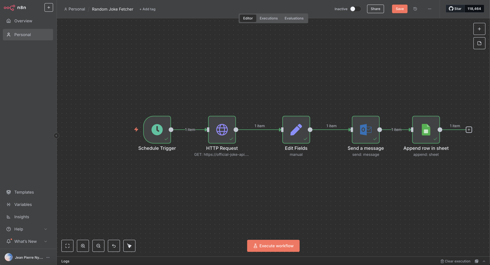

# n8n Local Docker Setup

This repository documents my local installation of n8n on MacBook for testing workflow automations.

---

## 🚀 Quick Start

### ✅ Prerequisites

- Docker Desktop installed and running
- Chrome browser (recommended)
- Git installed

---

## ⚙️ Running n8n

Use this Docker command:

docker run -it --rm
--name n8n
-p 5678:5678
-v ~/.n8n:/home/node/.n8n
-e N8N_RUNNERS_ENABLED=true
n8nio/n8n


✅ Then open:  
[http://localhost:5678](http://localhost:5678)

---

## ✅ Notes

- Use Chrome or Firefox to avoid secure cookie issues.
- Workflows are saved in `~/.n8n`.
- To stop, press `Ctrl + C` in Terminal.

---

## ✨ Future Improvements

- Add Docker Compose for easier start/stop.
- Enable HTTPS if deploying publicly.

--
---

## 🖼️ Screenshots

Below are example screenshots of my local n8n setup and workflow execution.

### Docker Desktop Container

This shows the n8n container running via Docker Desktop.


---

### Random Joke Workflow

This workflow fetches a random joke and emails it via Outlook.


---

## ✨ Random Joke Emailer + Google Sheets Logger

This workflow:
- Fetches a random joke from the Official Joke API
- Combines the setup and punchline dynamically
- Sends the joke via Outlook email
- Appends the joke and timestamp to a Google Sheet

### Example Expressions

**Date field:**
```javascript
{{ new Date().toISOString() }}
{{ $node["HTTP Request"].json["setup"] + " " + $node["HTTP Request"].json["punchline"] }}

### Workflow Screenshot



